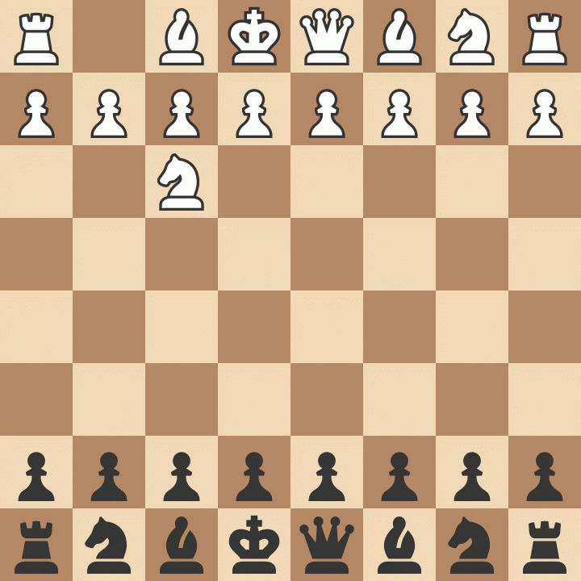

# simPLY_chess

## Introduction

A simple chess engine written in Python. This project was heavily inspired by [Sunfish](https://github.com/thomasahle/sunfish/tree/master), including some of its ports to faster languages as well as other engines based around Sunfish. The [Chess Programming Wiki](https://www.chessprogramming.org/Main_Page) was of great help since it explains nearly every chess programming concept in detail.

## How to play against simPLY_chess

 I initially planned to use the official [API](https://github.com/lichess-bot-devs/lichess-bot) to put the engine on [Lichess](https://lichess.org/) but until then, just import the engine in a [UCI](https://gist.github.com/DOBRO/2592c6dad754ba67e6dcaec8c90165bf) [GUI](https://www.chessprogramming.org/GUI) if you want to play against it.

 

 _A game that I (with the black pieces) played against simPLY_chess and won_

## Features

- [Piece material values](https://www.chessprogramming.org/Point_Value) for the core of the [evaluation](https://www.chessprogramming.org/Evaluation) function

- [Piece square tables](https://www.chessprogramming.org/Piece-Square_Tables) to give the engine positional "knowledge"

- Basic [transposition table](https://www.chessprogramming.org/Transposition_Table) (without hashing) to improve search times and limit redundant computation by storing the results of previous searches

- 4-ply [negamax search](https://www.chessprogramming.org/Negamax) algorithm with [alpha-beta pruning](https://www.chessprogramming.org/Alpha-Beta) to greatly reduce the number of nodes searched by pruning branches that are either too good or too bad

- [Quiescence search](https://www.chessprogramming.org/Quiescence_Search) to avoid the [horizon effect](https://www.chessprogramming.org/Horizon_Effect) along with [delta pruning](https://www.chessprogramming.org/Delta_Pruning) to further reduce the number of nodes searched

- [Iterative deepening](https://www.chessprogramming.org/Iterative_Deepening) framework to counter-intuitively speed up search times through simplified [PV move ordering](https://www.chessprogramming.org/Move_Ordering) from the last fully-completed search

- Utilizes [aspiration windows](https://www.chessprogramming.org/Aspiration_Windows) in order to improve the effectiveness of [alpha-beta pruning](https://www.chessprogramming.org/Alpha-Beta) by tightening the bounds of the search window

- [Tapered evaluation](https://www.chessprogramming.org/Tapered_Eval) to interpolate between the evaluation of the position using middlegame and endgame criteria

- Communicates through standard [UCI](https://gist.github.com/DOBRO/2592c6dad754ba67e6dcaec8c90165bf) protocol to allow for easy integration into any [GUI](https://www.chessprogramming.org/GUI)
  - Accepted commands:
    - `uci` - Initiates UCI protocol
    - `isready` - Synchronizes and initializes engine
    - `quit` - Terminates the engine
    - `ucinewgame` - Notifies engine that next search will be from a different game (and resets transposition table)
    - `position [fen <fenstring> | startpos ]  moves <move1> ... <movei>` - Sets up the board position according to the given FEN string and/or moves
    - `go` - Calculate the best move for the current position
    - `eval` - Return the static evaluation of the current position
    - `board` - Print the current board position in ASCII art and with the FEN string

## Limitations

- Relies on a [GUI](https://www.chessprogramming.org/GUI) for features like time control and stalemate/checkmate detection

- Written in Python meaning that it isn't too strong since it can't search past a depth of 4 ply in a reasonable amount of time

- Does not take [3-fold repetition](https://www.chessprogramming.org/Repetitions#Fide_Rule) or the [fifty-move-rule](https://www.chessprogramming.org/Fifty-move_Rule#Fide_Rule) into account meaning that those rules can be exploited when the engine has a winning position

- Does not have an [opening book](https://www.chessprogramming.org/Opening_Book) meaning that it has almost no variation in the [opening](https://www.chessprogramming.org/Opening) stage of the game

## My Thoughts

I decided to program this engine because I enjoy playing chess and I figured it would be a challenging project. Despite all of its limitations, the engine actually plays well enough to draw with and even beat me sometimes. There are many ways I could improve the playing strength of the engine (both through new features and optimizations), but for now, I'll just leave it as is. Overall, I learned a lot about search algorithms and I really enjoyed working through this project.
